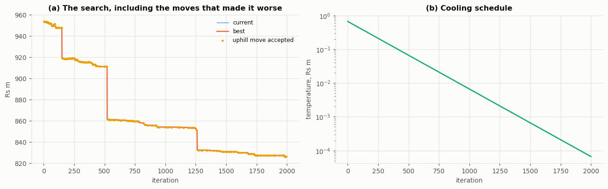
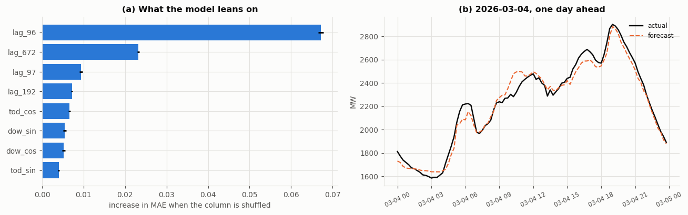

**Module:** 7COSC013W Foundations of AI

**Coursework:** 1 of 2

**Project title:** Dispatch Lab: could the Sri Lankan grid have been scheduled better?

**Student name:** Danuja Wijerathna

**UoW number:** 20251143

**Submission date:** 5 January 2027

```{=openxml}
<w:p><w:r><w:br w:type="page"/></w:r></w:p>
```

# Dispatch Lab: could the Sri Lankan grid have been scheduled better?

**7COSC013W Foundations of AI, CW1 Technical Report**

## 1. Introduction and context

Every evening, the Ceylon Electricity Board (CEB) decides which of its power plants will run the next day, and how hard each will run, across all 96 quarter-hours of that day. The decision is called unit commitment. It is hard because the choices interact: a plant cannot run below its minimum stable output, it must stay on for hours once started, its output can only move so fast between intervals, and each reservoir holds one day of water. A choice made at four in the afternoon decides what is possible at the evening peak.

The stakes in Sri Lanka are unusually visible. A single day of generation on the days studied here costs between about 200 and 1,000 million rupees, and the expensive part is imported fuel. The country went through a fuel crisis in 2022. On 9 February 2025 it lost power nationwide, in a blackout blamed on too few large machines spinning during high midday solar. Scheduling well is not an abstract goal here. It is money and it is lights.

This project rebuilds CEB's daily scheduling problem from the regulator's published record and asks whether the operator could have done better. Four methods answer the same question on the same days: a knowledge graph with a rule base (the operator's own logic, made inspectable), simulated annealing (search with lookahead), an exact optimiser (the provable best), and a demand forecast that feeds the schedulers (so the price of predicting badly can be measured).

The report makes three main claims, each backed by measurement. First, most of the money left on the table is in how plants are loaded, not in which plants are committed. Second, search closes about three quarters of the operator's remaining gap to the proven optimum. Third, two design choices that the literature and my own plan favoured turned out to be wrong on this system, and the reasons why are more useful than the claims would have been.

## 2. Background and related work

Unit commitment has been studied for over half a century, and Padhy (2004) surveys the long list of methods tried on it: priority lists, dynamic programming, Lagrangian relaxation, genetic algorithms, and more. Three strands matter for this project.

**Exact optimisation.** Modern practice writes unit commitment as a mixed-integer linear program (MILP) and hands it to a branch-and-bound solver. How the problem is written matters as much as the solver. Morales-España, Latorre and Ramos (2013) showed that a formulation carrying explicit start-up and shut-down variables, tied to the on/off variable by a simple balance equation, gives a much tighter relaxation than the textbook version and can cut solve times sharply. Knueven, Ostrowski and Watson (2020) compare many such formulations and maintain the open benchmark library (pglib-uc) used for reference in this project. This project implements both the tight three-binary formulation and the naive one, and measures the difference on its own instances rather than quoting the papers.

**Metaheuristic search.** Simulated annealing (Kirkpatrick, Gelatt and Vecchi, 1983) accepts worse solutions with a probability that falls as a temperature cools, which lets it climb out of local traps. It was applied to unit commitment early (Zhuang and Galiana, 1990), and a wider family of population methods followed, including the genetic algorithm study by Kazarlis, Bakirtzis and Petridis (1996) whose ten-unit test case became a standard benchmark. These methods remain attractive because they need no gradient and no special problem structure. The standard split, used here, is to search only over the on/off decisions and solve the loading underneath each candidate exactly as a linear program, so every candidate is priced at its best and the search is judged purely on its commitment choices.

**Load forecasting.** Electricity demand has strong daily and weekly patterns, and simple seasonal methods are known to be hard to beat (Taylor, 2003). Hong and Fan (2016) stress that a forecast should be judged against a strong naive baseline, not a weak one. This project uses gradient boosting (Friedman, 2001) and holds it to a seasonal naive that scores 7.39% MAPE, which is genuinely strong. One published piece of advice, that the weekly seasonal naive beats the daily one for load, turned out to be false on this system, and the baseline was chosen from the data instead.

For the knowledge representation arm, the project follows the broad idea of a knowledge graph (Hogan et al., 2021): facts held as a typed graph, with reasoning done by rules over it. The specific value here is provenance. Which river a dam sits on cannot be learned from a time series. It has to be asserted from domain knowledge, and the graph records that difference so every answer can say how it knows.

## 3. Method and system design

### 3.1 The problem, made concrete

One day is one problem instance: 33 schedulable units across 96 intervals of 15 minutes. The decision variables are the on/off state and the output of each unit in each interval. The constraints are demand balance, a spinning reserve margin, minimum and maximum stable output, minimum up and down times, ramp limits, a minimum count of synchronised machines, and a daily energy budget for each hydro unit. Five aggregated feeds (wind, mini hydro, rooftop solar) are not decisions. Their output is subtracted from demand first.

As a task environment: the performance measure is cost subject to zero violations, with feasibility reported beside cost and never blended into it; the actuators are the commitment matrix and the output under it; the sensors are the published record, the cost reports and the plant metadata. That environment is partially observable, since inflows, outages and the network are absent from the record, stochastic, since demand is forecast rather than known, and sequential. Sequential does the work here. Were the intervals independent this would be 96 sorting exercises and merit order would be optimal, and everything the search arms exist for follows from the fact that they are not. The arms are four agent designs on that one environment: Arm A goal based, driven by condition and action rules that satisfy a target and stop; Arms B and C utility based, maximising an objective rather than meeting a threshold, which is what lets them accept a worse 16:00 for a better 19:00; Arm D the learning element supplying the percept the others act on.

Every arm receives this same instance object and returns the same schedule object. That is what makes the comparison fair: the arms differ in how they decide, and in nothing else.

### 3.2 Every parameter is derived, and the derivation is checked

No constraint in the model is a textbook number. Each is measured from what the operator actually did. Minimum outputs come from the low tail of each unit's observed output, capacity from the larger of the published rating and the observed peak (one coal unit runs to 275 MW against a 270 MW rating), ramp limits from the tail of observed 15-minute changes, and minimum run times from the distribution of observed on and off spells. The reserve requirement is read from the headroom the operator actually held, and the minimum machine count from the fewest they ever ran, checked either side of the February 2025 blackout (it rises from 8 to 9 after it).

Deriving parameters this way has a failure mode: set a bound from a middle percentile and the real schedule breaks it. An early version did exactly that and put 385 violations into CEB's own dispatch for a single day, which is nonsense. The fix is a calibration gate that runs the observed schedule through its own model. The final constraint set leaves only 0.242% of unit-intervals in violation, and that residue is the price of using tail quantiles rather than the record maximum.

### 3.3 The four arms

**Arm A, merit order over the knowledge graph.** The graph holds the fleet as typed nodes (units, fuels, river basins, rules) with typed edges between them, and every fact carries its origin: measured from the record, published by the regulator, or asserted from domain knowledge. The asserted parts are the point. Which river a dam sits on cannot be read from a time series, yet it creates a real constraint, because stations on one river share water. The two asserted cascades were then checked against the data: every strongly correlated pair of hydro stations (correlations around 0.8) falls inside a basin that was asserted independently, which is corroboration the graph could not have given itself. One rule is deliberately empty: must-run status cannot be told apart from "runs constantly because it is free" in this data, so nothing is asserted without a source.

The arm itself walks the units cheapest first, committing until demand plus reserve is covered, with the rule base forcing or vetoing along the way. Hydro is handled separately, because at zero fuel cost a reservoir always looks like the best plant, but its limit is energy, not capacity. Every commitment records which rule caused it. This arm is the honest baseline: it is roughly the operator's own logic, and its known weakness (no lookahead) is the reason the search arms exist.

**Arm B, simulated annealing.** The space being searched is the on/off matrix: 33 units across 96 intervals gives 2 to the power 3,168 possible patterns, so no method can look at them all. The annealer walks it with three move types: flip one interval, flip a run of intervals the length of the unit's minimum run, or swap a stretch of one unit for another. A cheaper candidate is always accepted. A dearer one is accepted with probability exp(-d/T), where d is the extra cost and T is a temperature that falls each step, so early on the search wanders and late on it only improves.

Two engineering choices made the search affordable. First, candidates that break minimum run times are repaired into the nearest legal schedule rather than thrown away, and a move that repair undoes completely is re-proposed rather than priced, so no solver call is spent rediscovering the schedule we already have. Second, the loading under every candidate is solved exactly as a small linear program. That works because fuel cost is linear in output and every constraint is a bound or a difference between neighbouring intervals, and it means the arms are compared purely on their commitment choices. Unserved demand, spilled energy and overdrawn water carry prices far above any real plant, so every candidate can be scored, and a bad one comes back expensive rather than unanswerable.

All search parameters were derived or tuned, never copied: the start temperature comes from the measured cost distribution of random moves, the move-type weights from a pilot that measured what each move actually won (run flips earned about half the improvement, swaps a quarter, single flips the rest), and the cooling rate and iteration count from a sweep on six held-out days that never appear in any result. Figure 1 shows both measurements: the convergence curve that sets the iteration budget, and the tuning surface, where a colder start and faster cooling win everywhere on the grid.

{width=6.3in}

The start temperature taught the sharpest lesson. The textbook recipe sets it from the average cost of a worsening move. On this problem that average is broken, because the move distribution has a violent tail: about one random move in five stops a machine the evening peak needed, and that mistake is priced in unserved energy, so the mean worsening move costs around 14 times the median one. A temperature set from the mean (131 million rupees on one test day) describes the disasters, not the typical step, and a search that hot accepts almost anything. The symptom appeared before the cause did: the first version made no progress at all between iterations 500 and 2,500, then improved in a rush once it finally cooled. Setting the temperature from the median (9 million rupees on the same day) fixed the shape of the whole search, and the tuning sweep then agreed, picking the coldest start and the fastest cooling in the grid.

Figure 2 shows one tuned run in full. The scattered points are the uphill moves the method deliberately accepts while it is still hot. Each is a schedule that costs more than the current one, taken anyway, and they are what let the search leave its merit-order start far behind.

{width=6.3in}

**Arm C, exact MILP.** The same day written as a mixed-integer program and solved by branch and bound, using the HiGHS solver (Huangfu and Hall, 2018) that ships with SciPy. Branch and bound is worth naming as informed search on a tree of partial commitments. At each node the cost already fixed is the path cost and the linear relaxation of what remains bounds the cost still to come, and that bound is an admissible heuristic in the strict sense: relaxing constraints can never make a problem dearer, so it can never overshoot. Expanding the node of lowest path cost plus bound, and discarding any node whose bound exceeds the incumbent, is A star on that tree. Two formulations are built. The tight one, following Morales-España, Latorre and Ramos (2013), gives each unit three binary variables per interval: on/off u, start-up v and shut-down w, tied together by the balance u[t] minus u[t-1] equals v[t] minus w[t]. Minimum run times then become simple sums: a unit that started inside the last few hours must still be on, so the sum of its recent v values cannot exceed u[t], and the mirror rule holds for shut-downs. Start-up cost sits directly on v, and output is measured above the minimum stable level, so being on buys the minimum and the solver only decides the rest. The naive textbook version keeps only u and rebuilds starts from the difference u[t] minus u[t-1]. Both describe exactly the same set of legal schedules. What differs is the shape of the relaxed problem around them, which is what branch and bound actually explores, and Section 6 reports what that difference is worth here.

The full day at 15-minute resolution (9,504 binary variables) does not solve to proven optimality within five minutes, so a reduced instance is used for the provable bound. Which reduction is safe was measured, not assumed: dropping units breaks the day (keep only the eight largest and even the real record cannot be replayed without shedding 1,184 MWh), while averaging time to hourly changes nothing that matters. So the reduction keeps all 33 units and coarsens time alone, and it solves to proven optimality on all twelve reporting days in 18 seconds on average.

**Arm D, demand forecast.** Gradient boosting on calendar features and lagged demand. The data has a 292-day hole (an API outage), and recorded demand is 24.3% higher in the test period than in training, so the model predicts the shape of demand relative to a trailing weekly level, and every lag feature is expressed the same way.

That level shift is worth decomposing rather than naming, and doing so changes what it is. The regulator begins publishing an estimate of behind-the-meter rooftop solar in the 15-minute feed at the start of the test period, so the series gains a category of generation that existed before and was simply not counted. Rooftop entries go from 0.00% of the recorded feed to 16.5%, and excluding them the same comparison is only +3.8%. About five sixths of the apparent rise is therefore a change in what the feed measures, not in what the country consumed. The remedy is unaffected, because predicting shape against a trailing level absorbs a level shift whatever its cause, but the diagnosis is: this is drift in the instrument rather than in the phenomenon, which is the harder kind, since retraining on recent data cannot tell a model that the definition of its target moved. All windows stay inside contiguous blocks of data, the split is by time with the gap between train and test, and model selection uses rolling-origin validation inside the training block only. Figure 3 shows the three facts this design answers to: the upward drift the model cannot extrapolate, the agreement between training and test once the level is divided out, and the lags that actually carry signal at a day-ahead horizon.

{width=6.3in}

### 3.4 Evaluation protocol

Twelve reporting days, drawn evenly from the two usable data regimes, disjoint from the six tuning days. The annealer runs 15 seeds per day. Costs are compared with paired tests (Wilcoxon for pairs, Friedman across all arms), and feasibility is reported separately from cost. The primary metric is the optimality ratio against the proven optimum on the hourly instance, where every arm, and CEB's own commitment, is re-run on exactly that instance.

One choice deserves emphasis. The "CEB actual" baseline is CEB's commitment re-loaded by the same linear program the arms use. This is a large concession to the baseline (Section 5 measures it at 9.6% of the bill), but without it the comparison would mix up two different questions: who committed better, and who loaded better.

## 4. Implementation

The system is a small Python package (about 3,000 lines, with 40 tests) with one module per concern: data access, parameter derivation, the cost basis, the knowledge graph, the shared problem object, the exact dispatch step, one module per arm, evaluation, and export for the companion app. The graded notebook is generated from a source script and imports the package rather than redefining logic. It runs end to end from local files with a fixed seed, no network, and no absolute paths.

The tests exist because several bugs only showed up as slightly wrong numbers, not as crashes. One example: the repair step rounded minimum run times to the nearest interval, but a 2.34 hour minimum is ten quarter-hours, not nine, so repair kept approving schedules that the feasibility check then rejected. Each bug of that kind now has a test that fails if it comes back.

The expensive computations are separated from the notebook that reports them. The tuning sweeps, the seed repetitions and the exact solves add up to hours of solver time, so they run once through small driver scripts and land as tables of results on disk. The notebook reads those tables and stays quick to run end to end. Deleting the tables and re-running the drivers rebuilds everything, so nothing reported is a number that cannot be regenerated from the code.

Three implementation points carried real weight.

**The nested dispatch step had to be fast.** The annealer prices thousands of candidates per day, and each price is a linear program. The program's structure is built once per day and only the bounds and right-hand side change per candidate, which brought a solve to about 33 milliseconds alone and 80 to 130 milliseconds under a full worker pool. This is what made 15 seeds by 12 days affordable on a laptop.

**Data defects were found by gates, not by luck.** The pipeline has loud checks: the 15-minute record must integrate to the published daily energy, the evening peak must land where Sri Lanka's actually does, and the observed schedule must pass its own constraints. These caught, among other things, 1,650 duplicated plant-days in one table, a diesel price of 5,954 rupees per kWh that was really a fixed cost divided by near-zero output, and two days where a silently absent plant column would have turned the baseline's cost into a NaN.

**The solver was checked against something that is not a solver.** On a tiny instance (4 periods, 3 to 4 units), every possible commitment can be enumerated, filtered by the constraints, and priced. The cheapest survivor is the true optimum by definition. Both MILP formulations, the rule base and the annealer all land on it exactly. This matters because the two formulations agreeing had already caught one real bug: a transposed pair of coefficients made the naive formulation's relaxation exceed the tight formulation's optimum, which is impossible for a valid relaxation of the same problem.

## 5. Evaluation and results

### 5.1 The single most important number

Re-loading CEB's own commitment with the exact dispatch step, changing not one start or stop, cuts the bill by 9.58% on average across the reporting days (636.4 down to 568.2 million rupees). Every result below is measured after granting the baseline that saving. In other words, most of what an optimiser can offer this system is in the loading of the machines, not the choice of machines.

### 5.2 Against the proven optimum

On the hourly instance, where the exact solver proves the optimum on all 12 days:

| Schedule | Cost as a multiple of the optimum |
|---|---|
| Exact MILP (proven) | 1.0000 |
| Simulated annealing (Arm B) | 1.0147 |
| CEB's own commitment | 1.0523 |
| Merit order (Arm A) | 1.1367 |
| Commit everything | 1.3156 |
| Random commitment | 2.1236 |

The annealer lands 1.5% above the proven best. CEB's commitment sits 5.2% above it. So the search closes about 72% of the operator's remaining gap. Merit order at 13.7% shows the cost of having no lookahead, and the trivial baselines are nowhere, which confirms the problem is real.

### 5.3 At full resolution, and what the acceptance rule is worth

At the full 96-interval resolution the annealer's mean cost (566.2 million rupees) barely separates from the re-dispatched CEB baseline (568.2), beating it on only 4 of 12 days. Part of that is arithmetic: the full day carries 3,168 binary decisions against 792 in the hourly instance, and the convergence curve was still improving when the tuned iteration budget ran out. Figure 4 shows the day-by-day picture and the small spread across seeds.

Under-convergence is not the whole reason, and establishing that needed a control the evaluation did not originally have. Arm B differs from Arm A in three things at once: the neighbourhood, the repair step, and the rule that accepts worse schedules. Only the third makes the method annealing rather than hill climbing, so only the third can be credited for the difference. Setting the start temperature to zero isolates it, because the acceptance test then refuses every uphill move while neighbourhood, repair, iteration budget and seed stay identical.

The acceptance rule earns nothing measurable. On the hourly instance the two are indistinguishable: 555.6 against 556.0 million rupees, each cheaper on six of twelve days, Wilcoxon p = 0.91, optimality ratios 1.0147 and 1.0133. At full resolution the ordering reverses, hill climbing coming in 0.64% cheaper on nine of twelve days, but with twelve days that does not reach significance (p = 0.13) and I do not claim it. The defensible statement is the negative one, and it is enough: accepting uphill moves buys no measured improvement here, while costing 22% more wall clock at the same iteration budget, because the fuller commitments the search wanders into are slower to price.

It is consistent with the tuning sweep, which chose the coldest start and the fastest cooling in its grid, both at the boundary of what was tried.

{width=6.3in}

### 5.4 The forecast, and what error costs

The forecast scores 5.47% MAPE on the held-out year against the seasonal naive's 7.39%, a 26% error reduction. It only got there after a units lesson: with lag features in raw megawatts against a ratio target the model scored 8.0% and lost to the naive. Dividing the lags by the same trailing level as the target fixed it. Figure 5 shows what the fitted model relies on, which is reassuringly boring: the same interval yesterday dominates, with the weekly lag and time of day behind it, and one day of output tracks the real curve closely including the evening peak.

{width=6.3in}

Closing the loop, committing on the forecast and paying at the real demand costs on average 5.9% of the day's bill, with no load shed. The sharp finding is that forecast accuracy and forecast cost barely correlate (0.22 across the days tested). The most accurate day (2.88% MAPE) carried the largest cost penalty (10.3%), because its error sat at the evening peak, where it changed which machines had to be started hours earlier. An error twice as large spread across the night cost a third as much.

### 5.5 What the constraints and assumptions cost

Three ablations, each solved by the exact optimiser so the schedule re-optimises when the parameter moves (Figure 6). Raising the spinning reserve requirement from zero to 25% of demand costs only 0.10% of the bill, even though the constraint is active on 98% of candidate schedules. Both facts are true at once because the fleet carries cheap, fast hydro headroom, so the margin is held almost for free. Scaling the assumed start-up cost from zero to four times its value moves total cost by about one per cent, and the schedule responds sensibly, from 35 starts when starting is free down to 25.5 when it is dear. Since no conclusion changes anywhere across that sweep, the assumption is not load-bearing, which is the point of sweeping it. Removing minimum run times changes the cost by nothing at all while adding eight starts a day, and the reason is a gap in the cost data rather than a slack constraint: no start-up cost is published for hydro, so the model lets water cycle for free and only the run-time rule was stopping it.

{width=6.3in}

### 5.6 Statistical checks

Friedman rejects the idea that the arms are interchangeable (chi-squared 52.1, p below 1e-8, across 12 days and 7 schedules), and the paired Wilcoxon tests confirm each ordering discussed above. The annealer's spread over 15 seeds is small next to the differences between days, and its schedules are feasible: violations are counted separately throughout, and the reported schedules carry none.

## 6. Comparative analysis and trade-offs

**Exactness against scale.** The MILP proves its answer but cannot close the full-resolution day; the annealer scales to the full day but proves nothing. The useful design is the pair: the annealer does the work, the MILP prices how much better anyone could have done. Neither alone supports the claims this report makes.

**Where each method fails, and why.** Merit order fails at exactly the thing it cannot see: the future. It will not pay a little more at 16:00 to avoid paying much more at 19:00. The MILP fails by omission, through the reduction it needs to finish. The annealer fails in two ways that Section 5.3 separates. It is under-converged at full scale, and independently of that its acceptance rule is not buying anything. Those two failures share one explanation: exploration is an investment that only repays if there is budget left to exploit afterwards, and under a budget too small to converge, iterations spent climbing away from the incumbent cannot be earned back. Arm B's margin over merit order therefore belongs to its neighbourhood and repair step rather than to the Metropolis rule, which is a more precise description of the method than the one I set out to test.

**A negative result, kept.** The plan's claimed contribution was to guide the annealer's swap move with the knowledge graph: swap a unit only for one the graph says is comparable. Measured properly (paired seeds, Wilcoxon p = 0.003), the guided search is 0.8% worse than a blind one, on 10 of 12 days. The mechanism is now obvious in hindsight. The regulator publishes cost per plant type, so every unit inside a merit tier has an identical cost, and 96% of the graph's suggested swaps are between units whose costs differ by less than 1 rupee per kWh. A swap between equal-cost units cannot change the fuel bill. The graph's relation answers the question it was built for (which units are interchangeable) and is the wrong tool for search, which needs moves that change the objective. The knowledge graph still earns its place through explanation: every commitment in Arm A traces to a named rule, and the hydro cascade structure it asserts was independently corroborated by measured correlations between stations on the same river.

**A second expectation that failed.** The tight MILP formulation is reported in the literature to shrink the integrality gap substantially. On these instances both formulations' relaxations are already within 0.1% of the integer optimum, so there was no gap to shrink. The likely reason is structural: a large zero-cost hydro fleet and a cleanly separated merit order leave the fractional solution little room to cheat, and on a start-up-cost-dominated thermal system the textbook result would matter more.

The tight formulation still won, and the node counts say how. Its advantage is a better heuristic, in the sense set out in Section 3.3. On two of the three days studied both formulations closed at a single node, the bound being near perfect and nothing left to search. On the third the tight root bound was higher by 0.04%, 364.211 against 364.062 million rupees, and that cut the tree from 2,267 nodes to 38. A sixtyfold cut in the nodes that survived pruning, bought with a bound four hundredths of one per cent tighter, is the standard claim that a better heuristic reduces search cost, measured rather than quoted. The faster solve time is its symptom.

**Binding is not the same as expensive.** The reserve result in Section 5.5 is worth stating as a general lesson, because the two properties are easy to conflate. A constraint can shape almost every schedule the search visits and still cost nearly nothing, if what it demands happens to be abundant. On this system the abundant thing is fast hydro headroom, so security is close to free. On a thermal-dominated system the same sweep would price the same margin very differently, and a planner who only knew that the constraint "binds" would have no idea which world they were in.

**The forecast lesson.** The model was selected to minimise MAPE, and MAPE turns out to be only loosely related to the money a forecast error costs. A forecast that feeds a scheduler should be judged, and ideally trained, on the cost its errors cause. That metric mismatch was invisible until the loop was closed, and closing the loop is this project's most transferable idea.

## 7. Critical reflection and limitations

**The cost basis is the biggest limit.** PUCSL publishes cost per plant type, not per plant, so all three coal units share one price and no conclusion about an individual unit's economics is supportable. Start-up costs and CO2 factors are published nowhere; both are assumed and swept, and the sweep shows the ranking of the arms does not depend on them, but they remain assumptions. The free-cycling hydro behaviour in Section 5.5 is a direct consequence of this gap.

**The hydro budget grants hindsight.** Each reservoir is held to the energy it actually released that day. A real day-ahead planner does not know that number. The optimisers therefore move water within the day but never invent it, which is the honest middle ground, but the comparison still leans slightly in their favour. The budget is also enforced as a price rather than a wall, so the search can score any candidate it generates; a schedule that overdraws is expensive and is reported as infeasible, never hidden.

**Coverage is incomplete.** Thirty per cent of the span is missing, including most of 2025, so nothing here describes that period. Rooftop solar appears in the record available to this project only from 2026, and only as the regulator's estimate; the outage means the project can see when the estimate becomes visible in usable data, not when the regulator actually began publishing it. Weather is absent entirely; a temperature feed would likely improve the forecast, and its absence is stated rather than papered over.

A later audit of the derived parameters found one estimator that is too permissive about which intervals it reads. The ramp limit takes a high percentile across all intervals rather than only those where the unit was running on both sides, so for plant that almost never runs the off intervals dominate and pull the limit toward zero. One 16 megawatt peaking unit, generating in 0.09% of intervals, is affected and is held at its minimum output throughout. Its contribution to every reported result is immaterial at that duty cycle, and the correction is to take the percentile over running transitions only.

**The model is a single busbar.** There are no transmission constraints, no network losses, and no plant outage schedule. CEB's real schedule may respect constraints this model cannot see, which would flatter the optimisers. The 9.6% loading result should be read with that caveat, though its size suggests a real effect remains.

## 8. Conclusion and future work

On the twelve days measured, the answer to the project's question is yes, CEB could have scheduled better, but not mainly where I expected. About 9.6% of the bill was available from loading the same machines optimally. Beyond that, better commitment adds a smaller margin, and search recovers about three quarters of it where it converges, verified against a proven optimum rather than a best-effort answer.

The single idea I would carry forward is separation. Separating commitment from loading located the money. Separating forecast error from scheduling error showed that accuracy is the wrong target. Separating what the data can say from what must be asserted kept the knowledge graph honest, and separating a claimed contribution from its measured effect turned a failed idea into the most instructive result in the project.

Future work, in the order I would take it: a cost-aware forecast objective; a swap operator crossing the graph's cost tiers rather than staying inside them, which is where money moves; a solver licence that closes the full-resolution solve; network constraints from the published grid topology; and extending the record as the portal fills the 2025 gap.

## References

Friedman, J.H. (2001) 'Greedy function approximation: a gradient boosting machine', *Annals of Statistics*, 29(5), pp. 1189-1232.

Hogan, A., Blomqvist, E., Cochez, M., d'Amato, C., Melo, G.d., Gutierrez, C., Kirrane, S., Gayo, J.E.L., Navigli, R., Neumaier, S. and others (2021) 'Knowledge graphs', *ACM Computing Surveys*, 54(4), pp. 1-37.

Hong, T. and Fan, S. (2016) 'Probabilistic electric load forecasting: a tutorial review', *International Journal of Forecasting*, 32(3), pp. 914-938.

Huangfu, Q. and Hall, J.A.J. (2018) 'Parallelizing the dual revised simplex method', *Mathematical Programming Computation*, 10(1), pp. 119-142.

Kazarlis, S.A., Bakirtzis, A.G. and Petridis, V. (1996) 'A genetic algorithm solution to the unit commitment problem', *IEEE Transactions on Power Systems*, 11(1), pp. 83-92.

Kirkpatrick, S., Gelatt, C.D. and Vecchi, M.P. (1983) 'Optimization by simulated annealing', *Science*, 220(4598), pp. 671-680.

Knueven, B., Ostrowski, J. and Watson, J.-P. (2020) 'On mixed-integer programming formulations for the unit commitment problem', *INFORMS Journal on Computing*, 32(4), pp. 857-876.

Morales-España, G., Latorre, J.M. and Ramos, A. (2013) 'Tight and compact MILP formulation for the thermal unit commitment problem', *IEEE Transactions on Power Systems*, 28(4), pp. 4897-4908.

Padhy, N.P. (2004) 'Unit commitment: a bibliographical survey', *IEEE Transactions on Power Systems*, 19(2), pp. 1196-1205.

PUCSL (2026) *Electricity Generation Data Platform*. Public Utilities Commission of Sri Lanka. Available at: https://gendata.pucsl.gov.lk (Accessed: 27 July 2026).

Taylor, J.W. (2003) 'Short-term electricity demand forecasting using double seasonal exponential smoothing', *Journal of the Operational Research Society*, 54(8), pp. 799-805.

Zhuang, F. and Galiana, F.D. (1990) 'Unit commitment by simulated annealing', *IEEE Transactions on Power Systems*, 5(1), pp. 311-318.
